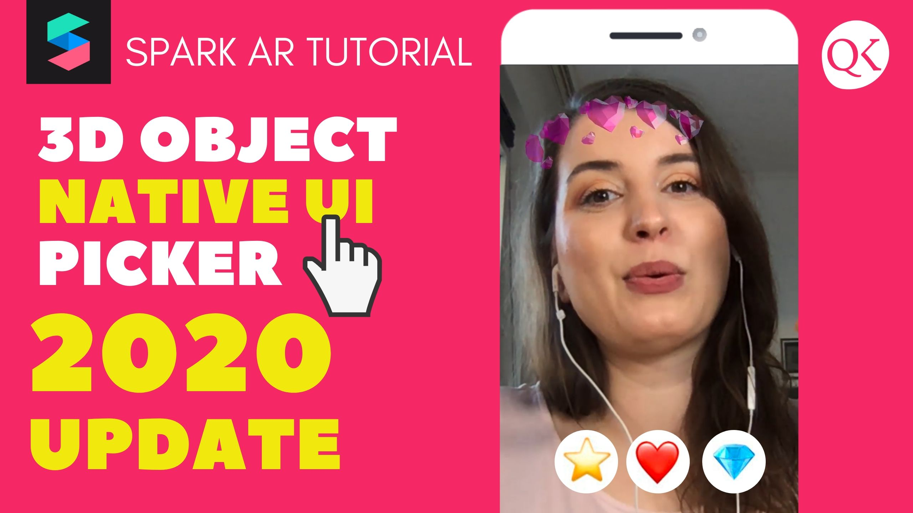

<h1> Glitter Effect in Spark AR </h1>

Tutorial on YouTube 
<a href="https://www.youtube.com/watch?v=Yumu3aqeRbI">Spark AR Native UI Picker 2020 for 3D Objects (update 85v)</a>

 

Learn more stuff by watching my <a href="https://www.youtube.com/channel/UC_ycBf44SNpOc7w6kvYkufA?view_as=subscriber">Spark AR Tutorials on YouTube</a>!

Follow me on Instagram <a href="https://www.instagram.com/qknowdesign/">@qknowdesign</a> if you have any question about SPARK AR!

Download my Spark AR projects on <a href="https://github.com/qknowdesign">Github</a>!

Have questions? Join the Spark AR Community group on Facebook.

<h1>Donations</h1>
If you used this in client projects, or simply enjoyed making effects with my open-source projects, please consider a donation or sponsorship. One-time donations and subscriptions can be made with PayPal.

<a href="https://www.paypal.com/cgi-bin/webscr?cmd=_s-xclick&hosted_button_id=ZJZCPPXBCGV8C&source=url" rel="nofollow"><input type="hidden" name="business" value="jankow9785@googlemail.com" /></a>
